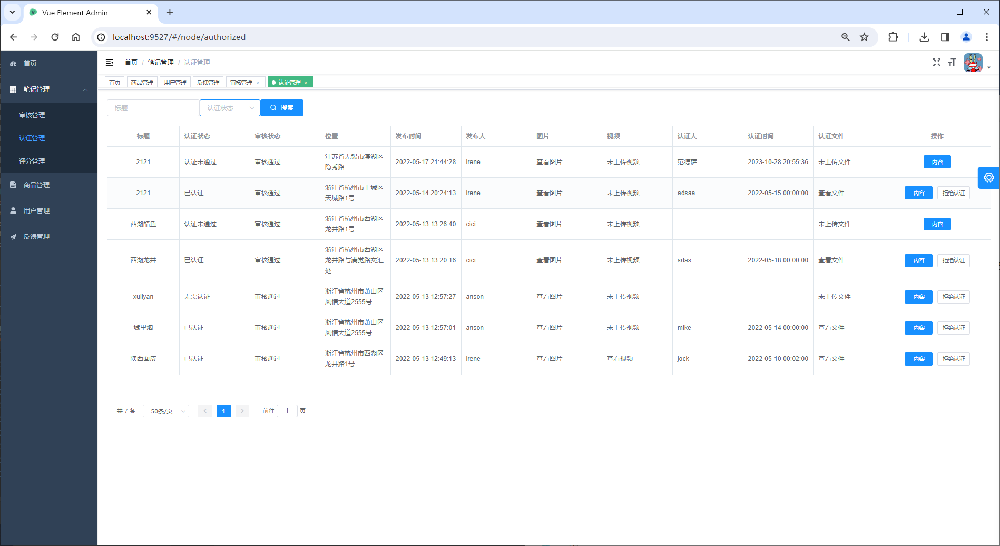
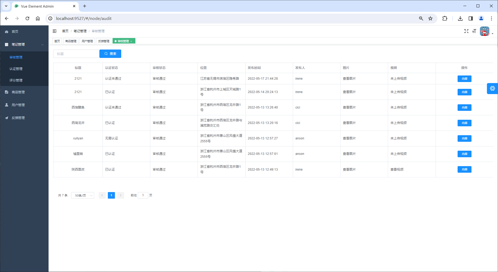
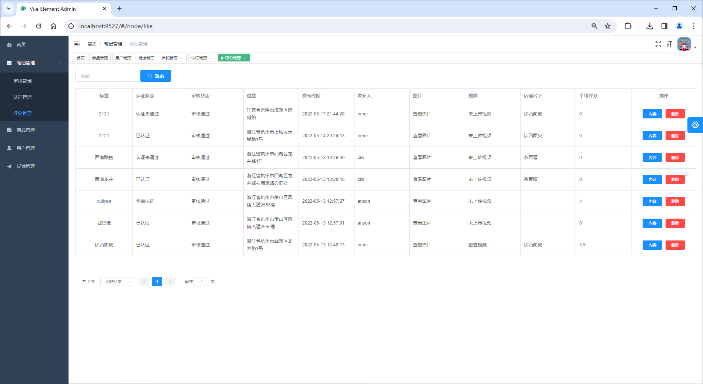
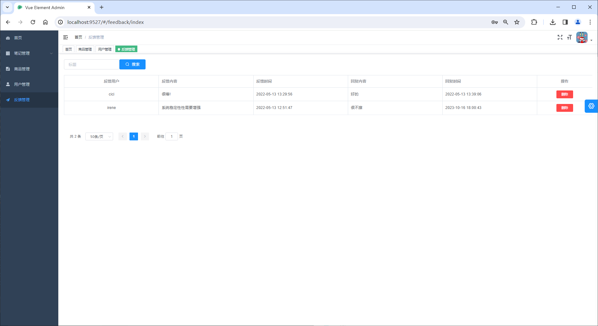
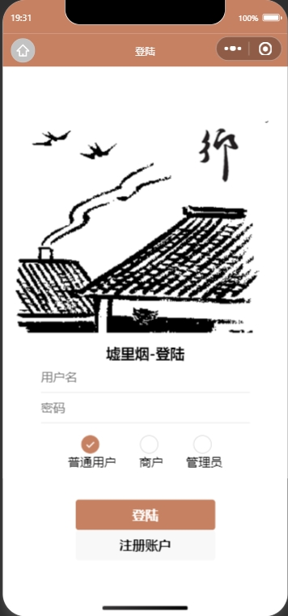
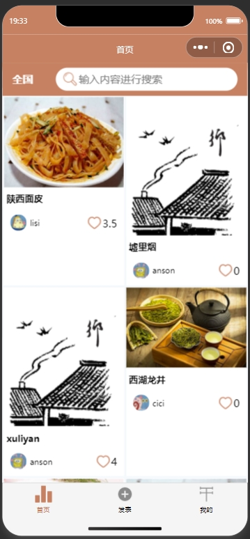

<h1 align="center">基于微信小程序+SpringBoot的乡村特产推广管理系统</h1>

<h4> 完整代码获取地址：从戎源码网（https://armycodes.com/） </h4>
<h4> 作者微信：19941326836 QQ：605739993 QQ群：655392706 </h4>
<h4> 承接计算机毕设、Java毕业设计、Python毕业设计、深度学习、机器学习 </h4>
<h4> 选题+开题报告+任务书+程序定制+安装调试+论文+答辩ppt 一条龙服务 </h4>
<h4> 毕业设计所有选题地址：(https://github.com/Descartes007/allProject) </h4>

## 一、项目介绍

基于微信小程序+SpringBoot的乡村特产推广管理系统：前端 微信小程序、Vue、ElementUI，后端 SpringBoot、Redis、Mybatis，系统角色分为：管理员、商户和用户，管理员在管理后台管理商品和笔记，对笔记进行认证，添加新管理员等；商户对商品进行发布、笔记发布等；用户根据发布的商品进行选购等。主要功能如下：

### 1、管理员：

- 基本操作：登录、完善个人信息、获取个人信息、修改密码
- 用户管理：获取用户列表、筛选用户、重置用户密码、删除用户
- 商品管理：获取商品列表、筛选商品、修改商品库存、删除商品、查看商品详情
- 反馈管理：获取反馈列表、筛选反馈、查看反馈详情、删除反馈、回复
- 审核管理：获取笔记审核列表、筛选笔记审核信息、查看内容详情、审核通过、审核不通过
- 认证管理：获取认证列表、筛选认证信息、查看认证详情、上传认证材料、拒绝认证、认证
- 评分管理：获取评分列表、查看评分详情、删除评分、查看内容详情

### 2、商户：

- 基本操作：登录、注册、修改密码、切换城市、分享小程序、反馈问题
- 笔记模块：获取笔记列表、搜索笔记、发表笔记、获取我的笔记列表、查看笔记详情、评论笔记
- 商品模块：购买商品、查看商品详情、查看等待发货商品
- 商品模块：获取商品列表、发布商品、查看已售商品列表

### 3、用户：

- 基本操作：登录、注册、修改密码、切换城市、分享小程序、反馈问题
- 笔记模块：获取笔记列表、搜索笔记、发表笔记、获取我的笔记列表、查看笔记详情、评论笔记
- 商品模块：购买商品、查看商品详情、查看等待发货商品

## 二、环境

- <b>IntelliJ IDEA 2020.3</b>

- <b>Mysql 5.7.26</b>

- <b>NodeJs 14.17.3</b>

- <b>Maven 3.6.3</b>

- <b>JDK 1.8</b>

## 三、小bug解决方案：
- 删除文件夹vue中的package-lock.json文件
- 重新 npm install

## 四、运行截图

